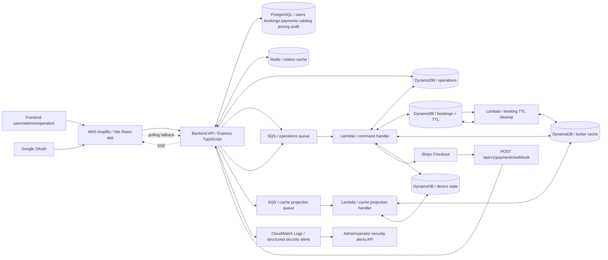

# Locker Network

Smart locker rental platform with role-based access, asynchronous locker operations, Stripe payments, PostgreSQL persistence, Redis and DynamoDB cache projections, audit logging, and AWS Lambda workers.

Current backend API version: `1.3.0`.

## Project Parts

| Path | Runtime | Responsibility |
|---|---|---|
| [`frontend`](./frontend) | React + Vite | User, operator, and admin UI. Integrates with the backend API and Google OAuth. |
| [`backend`](./backend) | Express + TypeScript | API, auth/RBAC, PostgreSQL access, Stripe webhooks, audit logs, security alerts, cache orchestration, and operation status reads. |
| [`lambda`](./lambda) | AWS SAM + TypeScript Lambda | SQS command processing, DynamoDB booking/operation state, locker cache projection, device simulation, and TTL cleanup. |

## Architecture



## Main Flows

### Booking And Payment

1. Frontend calls `POST /api/v1/bookings/init`.
2. Backend creates an operation record and sends `BOOKING_INIT` to SQS.
3. Lambda reserves a locker in DynamoDB, creates staged booking state, and creates a Stripe Checkout session.
4. Frontend reads operation completion by SSE or polling and redirects the user to Stripe.
5. Stripe calls `POST /api/v1/payments/webhook`.
6. Backend validates the Stripe signature and sends `PAYMENT_CONFIRM` or `BOOKING_EXTEND_CONFIRM` to SQS.
7. Lambda updates DynamoDB booking/cache state.
8. Backend persists finalized booking/payment state in PostgreSQL and exposes admin reconciliation routes for recovery.

### Locker Operations

1. Frontend calls device endpoints such as `POST /api/v1/devices/open-locker`.
2. Backend validates auth, role, booking/locker state, and idempotency.
3. Backend enqueues a device command to SQS.
4. Lambda processes the command, updates DynamoDB operation state, and simulates or executes the device action.
5. Frontend receives operation status through SSE or polling.

### Catalog Cache Projection

1. Admin/operator catalog changes are written to PostgreSQL.
2. Station cache is updated in Redis where applicable.
3. Backend sends locker projection messages to the cache projection SQS queue.
4. Lambda updates DynamoDB locker cache and device state projections.
5. Admin repair endpoints support resync, hard-resync, reconcile, and hard-refresh.

## API Documentation

Swagger UI is enabled outside production:

```text
http://localhost:3555/docs
```

Backend API documentation is maintained in three surfaces:

| Surface | Location | Current status |
|---|---|---|
| Markdown docs | [`backend/docs`](./backend/docs) | Domain docs and async/cache/device/logging contracts. |
| OpenAPI | [`backend/docs/openapi.json`](./backend/docs/openapi.json) | 66 paths covering 73 Express method/path operations. Matches current routes. |
| Postman | [`backend/postman/locker-backend.postman_collection.json`](./backend/postman/locker-backend.postman_collection.json) | 85 saved requests, including filtered scenario variants. Covers current routes. |

Maintenance rule: when a backend route changes, update the owning markdown file, OpenAPI, and Postman in the same change.

## Quick Start

### Full Local Stack

This starts PostgreSQL, Redis, LocalStack, DynamoDB Admin, and the backend container. Build Lambda artifacts first because LocalStack mounts them during bootstrap.

```bash
cd lambda
npm install
npm run build

cd ../backend
cp .env.localstack.example .env
docker compose down -v
docker compose up --build -d
docker compose ps
docker exec locker-backend wget -qO- http://localhost:3555/health
```

Local services:

| Service | URL |
|---|---|
| Backend API | `http://localhost:3555` |
| Swagger UI | `http://localhost:3555/docs` |
| Frontend | `http://localhost:5173` |
| PostgreSQL | `localhost:5433` |
| Redis | `localhost:6379` |
| LocalStack | `http://localhost:4566` |
| DynamoDB Admin | `http://localhost:8002` |

### Frontend

```bash
cd frontend
npm install
cp .env.example .env
npm run dev
```

Required local API setting:

```env
VITE_API_URL_BACKEND=http://localhost:3555/api/v1
```

### Backend Without Docker

```bash
cd backend
npm install
cp .env.example .env
npx prisma generate
npx prisma migrate dev
npm run dev
```

Backend startup requires:

- reachable PostgreSQL through `DATABASE_URL`
- JWT access/refresh secrets with at least 32 characters
- AWS credentials or LocalStack-compatible AWS values for DynamoDB/SQS
- Redis when station cache reads are enabled

### Lambda

```bash
cd lambda
npm install
npm run build
```

For SAM local development:

```bash
sam build
sam local start-api
```

## Backend Route Groups

| Group | Prefix |
|---|---|
| Health | `/health` |
| Auth | `/api/v1/auth` |
| Operations | `/operations`, `/api/v1/operations` |
| Cities | `/api/v1/cities` |
| Lockers and stations | `/api/v1/lockers` |
| Bookings | `/api/v1/bookings` |
| Payments webhook | `/api/v1/payments/webhook` |
| Admin users | `/api/v1/admin/users` |
| Admin payments | `/api/v1/admin/payments` |
| Admin audit logs | `/api/v1/admin/audit-logs` |
| Security alerts | `/api/v1/admin/security-alerts`, `/api/v1/operator/security-alerts` |
| Pricing | `/api/v1/pricing` |
| Devices | `/api/v1/devices` |

## Scripts

### Frontend

```bash
cd frontend
npm run dev
npm run build
npm run lint
npm run preview
```

### Backend

```bash
cd backend
npm run dev
npm run build
npm run lint
npm run lint:fix
npm start
```

`npm test` is currently a placeholder in `backend/package.json`.

### Lambda

```bash
cd lambda
npm run build
```

`npm test` is currently a placeholder in `lambda/package.json`.

## Repository Map

```text
locker-network-repository/
├── backend/
│   ├── docs/
│   │   ├── openapi.json
│   │   └── contracts/
│   ├── postman/
│   ├── prisma/
│   ├── src/
│   ├── tests/
│   ├── docker-compose.yml
│   └── README.md
├── frontend/
│   ├── public/
│   ├── src/
│   └── README.md
├── lambda/
│   ├── src/
│   ├── template.yaml
│   └── README.md
└── README.md
```

## Reference Documents

| Topic | Document |
|---|---|
| Backend guide | [`backend/README.md`](./backend/README.md) |
| Backend docs index | [`backend/docs/README.md`](./backend/docs/README.md) |
| Auth API | [`backend/docs/auth.md`](./backend/docs/auth.md) |
| Cities API | [`backend/docs/citiesOperations.md`](./backend/docs/citiesOperations.md) |
| Lockers API | [`backend/docs/lockers.md`](./backend/docs/lockers.md) |
| Stations API | [`backend/docs/stations.md`](./backend/docs/stations.md) |
| Pricing API | [`backend/docs/pricing.md`](./backend/docs/pricing.md) |
| Bookings API | [`backend/docs/bookings.md`](./backend/docs/bookings.md) |
| Payments API | [`backend/docs/payments.md`](./backend/docs/payments.md) |
| Users/admin API | [`backend/docs/users.md`](./backend/docs/users.md) |
| Booking contracts | [`backend/docs/contracts/booking-flow-contracts.md`](./backend/docs/contracts/booking-flow-contracts.md) |
| Cache contracts | [`backend/docs/contracts/cache.md`](./backend/docs/contracts/cache.md) |
| Device contracts | [`backend/docs/contracts/locker-device-flow-contracts.md`](./backend/docs/contracts/locker-device-flow-contracts.md) |
| Security logging contracts | [`backend/docs/contracts/logger-contracts.md`](./backend/docs/contracts/logger-contracts.md) |
| Frontend guide | [`frontend/README.md`](./frontend/README.md) |
| Lambda guide | [`lambda/README.md`](./lambda/README.md) |

## Operational Notes

- Do not commit `.env` files or production secrets.
- Use [`backend/.env.localstack.example`](./backend/.env.localstack.example) for the Docker Compose LocalStack flow.
- PostgreSQL is the durable source of truth for users, finalized bookings/payments, catalog, pricing, and audit logs.
- Redis stores station cache data.
- DynamoDB stores operation state, staged booking state, locker cache projections, and device state.
- SQS connects backend commands to Lambda workers.
- Stripe webhook traffic uses raw JSON parsing at `/api/v1/payments/webhook`.
